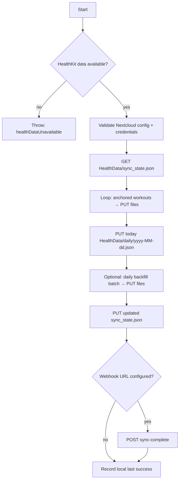

# Sync pipeline, remote state, and failures

This document complements [ARCHITECTURE.md](ARCHITECTURE.md): one full **foreground** sync pass, what is stored in **`HealthData/sync_state.json`**, and how errors reach the UI or notifications.

## JSON schema source of truth

- **Daily and workout JSON** field names and semantics are defined in the knowledge base implementation plan — **section 4 (*Формат и хранение данных*)** in  
  `Документация/Задачи/выполненные/Apple Health iOS приложение — план реализации.md`  
  (same tree as the HealthSync repo when synced via Nextcloud).
- **App version `0.1.0`** (see `project.yml` / Xcode) does **not** embed a `schema_version` field inside exported JSON files. If the export shape changes in a breaking way, add a version field and document the migration here.

Remote **`sync_state.json`** keys match `SyncState` in code (`HealthSync/Models/SyncState.swift`): `last_synced_at`, `last_daily_export_date`, `workout_query_anchor`, `daily_backfill_oldest_completed`, optional `notes`.

## One sync pass (foreground `syncNow()`)

Operations run in order; a failure **throws** and **stops** the pipeline (nothing after that runs in the same invocation).

**Background** `syncNowUsingBackgroundUploads` builds the same payload list (workouts → today daily → backfill dailies → `sync_state.json`), then uploads via a **sequential** background `URLSession` chain; the webhook runs **after** uploads in that flow (see `SyncService`).

## Remote state (what “incremental” means)

| Field in `sync_state.json` | Role |
|----------------------------|------|
| `workout_query_anchor` | Base64 `HKQueryAnchor` for **incremental workouts** only. |
| `daily_backfill_oldest_completed` | Earliest **calendar day** (`yyyy-MM-dd`) for which a **historical** daily JSON was written during backfill. |
| `last_daily_export_date` | Calendar day key for the last **today-style** daily export in that run. |
| `last_synced_at` | UTC ISO8601 timestamp string after a successful write of `sync_state.json`. |

**Local UI timestamp** (`SyncRunStore`) is updated only after a **successful** full run (including webhook if configured); it is **not** a substitute for `sync_state.json` when debugging server-side state.

## Failure modes

### Errors thrown by layer

| Layer | Typical errors | When |
|--------|----------------|------|
| `SyncService` | `healthDataUnavailable` | HealthKit not available on device. |
| `NextCloudService` | `missingBaseURL`, `missingCredentials`, `invalidHTTPResponse`, `server(statusCode:)`, `backgroundUploadAlreadyInProgress` | Bad/missing settings; HTTP not as expected; WebDAV error; second background chain started. |
| `SyncWebhookClient` | `invalidWebhookResponse`, `webhookRejected(statusCode:)` | Non-HTTP response or status outside 2xx. |

Other failures (encoding, HealthKit queries, `URLSession` transport) surface as **system** `Error` with `localizedDescription`.

### User-visible behavior

| Surface | Behavior |
|---------|----------|
| **MainView** | Foreground **Sync now** / **Sync (background)** show `error.localizedDescription` in red when the completion path fails. |
| **Settings** | Saving credentials can throw; validation uses WebDAV and surfaces transport/server errors. |
| **Local notifications** | If enabled, background observer path can notify success or **“Background sync failed: …”** with the same string as `localizedDescription`. |

There is **no** per-error localized catalog in app code today: messages are whatever Swift and `URLSession` produce for the underlying types.

### Partial failure

- **Foreground:** If any `upload` throws, `sync_state.json` is **not** updated in that run; previously remote files may already have been written in the same attempt (e.g. some workouts uploaded). The next successful sync overwrites state with a consistent anchor/day cursor.
- **Background:** The upload chain reports **one** failure for the whole sequence; the app does not resume mid-chain automatically.

## Related code

- `HealthSync/Services/SyncService.swift` — ordering and webhook.
- `HealthSync/Models/SyncState.swift` — JSON keys.
- `HealthSync/Utilities/SyncRunStore.swift` — local “last success” for UI.
